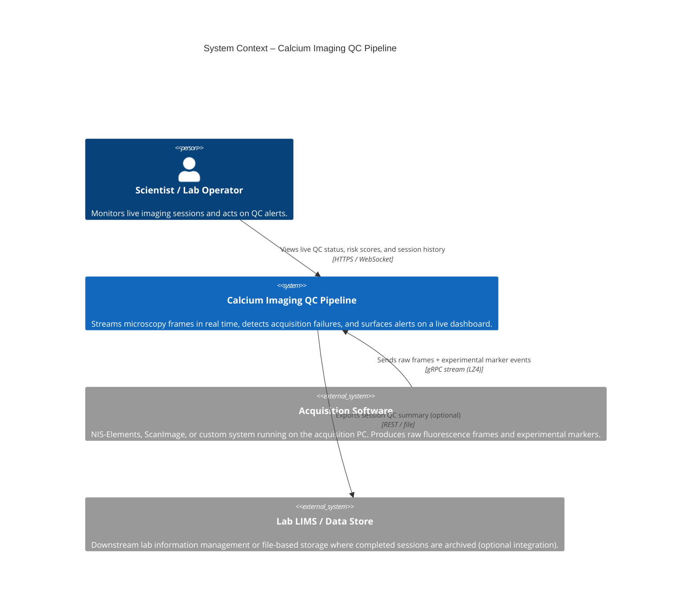
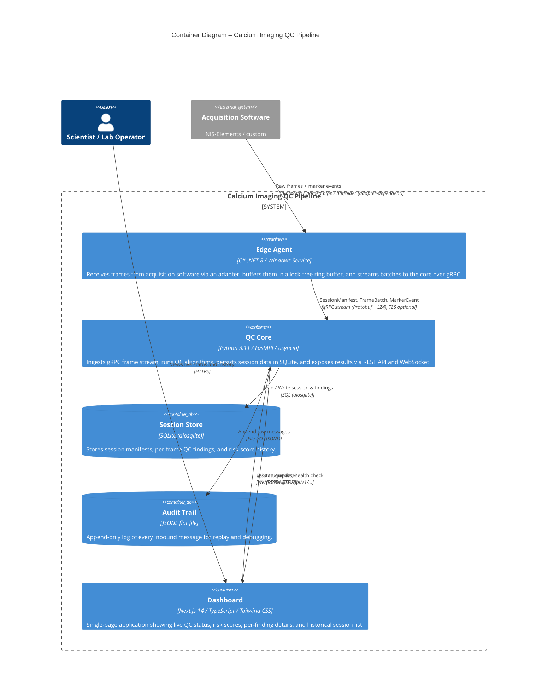
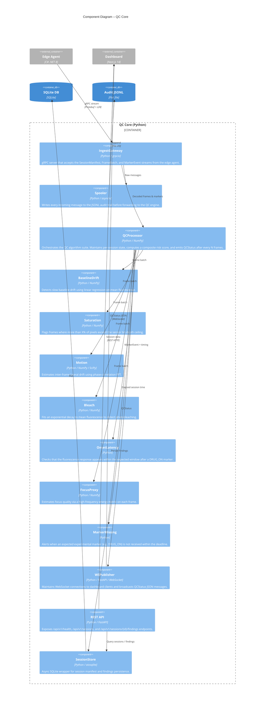
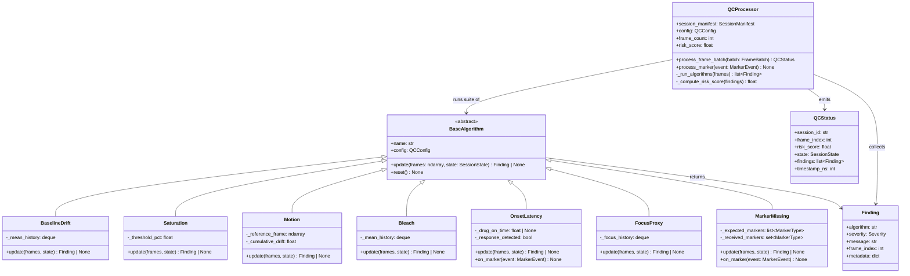

# C4 Architecture Diagrams

This document contains [C4 model](https://c4model.com) diagrams for the Calcium Imaging QC Pipeline at four levels of abstraction.

- [Level 1 – System Context](#level-1--system-context)
- [Level 2 – Container](#level-2--container)
- [Level 3 – Component (Core)](#level-3--component-core)
- [Level 3 – Component (Edge Agent)](#level-3--component-edge-agent)
- [Level 4 – Code (QC Algorithms)](#level-4--code-qc-algorithms)

---

## Level 1 – System Context

Shows the QC Pipeline as a single system and its relationships with users and external systems.



---

## Level 2 – Container

Shows the three runtime deployable units (containers) and the protocols between them.



---

## Level 3 – Component (Core)

Shows the internal components of the **QC Core** container.



---

## Level 3 – Component (Edge Agent)

Shows the internal components of the **Edge Agent** container.

```mermaid
C4Component
  title Component Diagram – Edge Agent (C# .NET 8)

  System_Ext(acqSoftware, "Acquisition Software", "NIS-Elements / custom")
  Container_Ext(qcCore, "QC Core", "Python / gRPC server")

  Container_Boundary(edgeAgent, "Edge Agent (C# .NET 8)") {

    Component(adapterHost, "AdapterHost", "C# / .NET 8", "Loads the configured IFrameSourceAdapter at startup, wires its events to the ring buffer, and manages the adapter lifecycle.")

    Component(adapter, "IFrameSourceAdapter", "C# interface / SDK", "Pluggable acquisition adapter. Bundled implementations: SimulatedAdapter, HotFolderAdapter, NisElementsAdapter.")

    Component(ringBuffer, "RingBuffer<Frame>", "C# / lock-free", "10-second circular buffer that decouples the acquisition thread from the gRPC streaming thread. Silently drops the oldest frame when full.")

    Component(streamerClient, "StreamerClient", "C# / Grpc.Net.Client", "Reads frame batches from the ring buffer, LZ4-compresses pixel data, and sends them to the core via a bidirectional gRPC stream.")

    Component(configLoader, "ConfigLoader", "C# / Microsoft.Extensions.Configuration", "Merges YAML config hierarchy with environment-variable overrides (QC_ prefix) at startup.")
  }

  Rel(acqSoftware, adapter, "Frames + markers", "In-process / hotfolder / API")
  Rel(adapter, adapterHost, "FrameReady, MarkerEmitted, SessionManifestReady events")
  Rel(adapterHost, ringBuffer, "Enqueue Frame")
  Rel(ringBuffer, streamerClient, "Dequeue batch")
  Rel(streamerClient, qcCore, "SessionManifest / FrameBatch / MarkerEvent", "gRPC stream (Protobuf + LZ4)")
  Rel(configLoader, adapterHost, "AdapterConfig")
  Rel(configLoader, streamerClient, "StreamingConfig")
```

---

## Level 4 – Code (QC Algorithms)

Shows the key classes and relationships within the **QCProcessor** and its algorithm modules.


